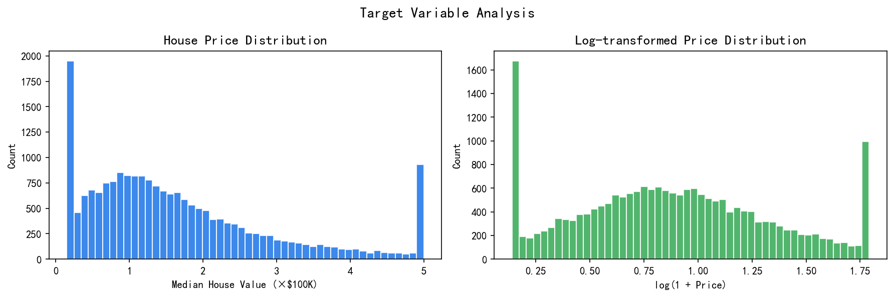
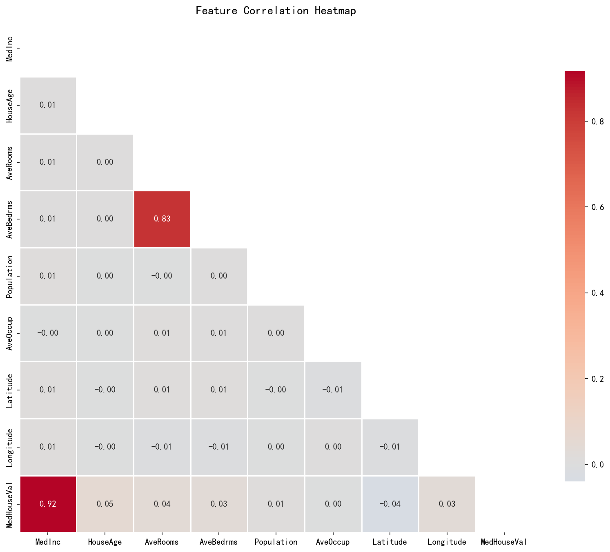
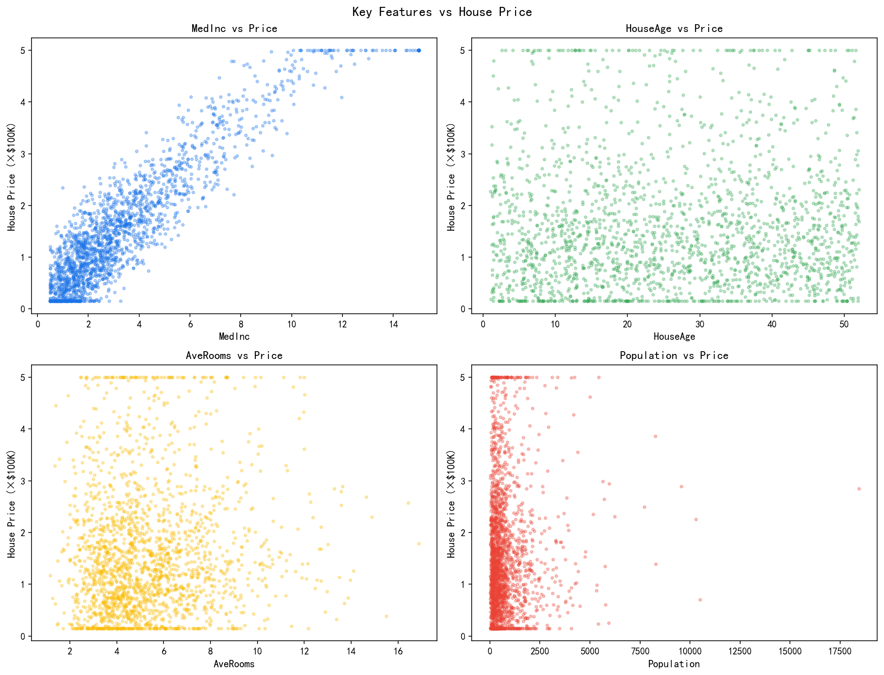
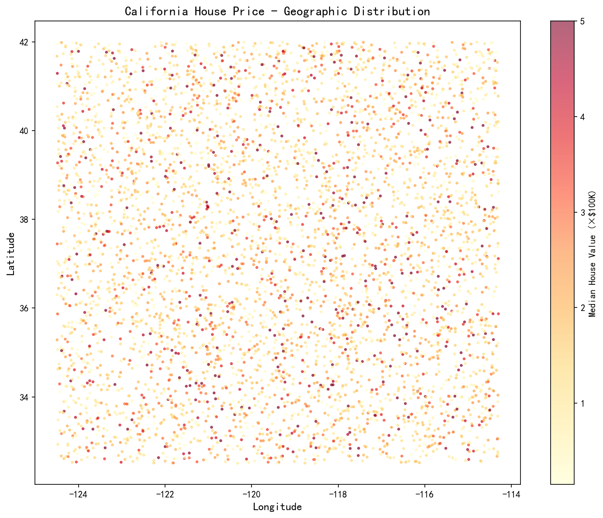
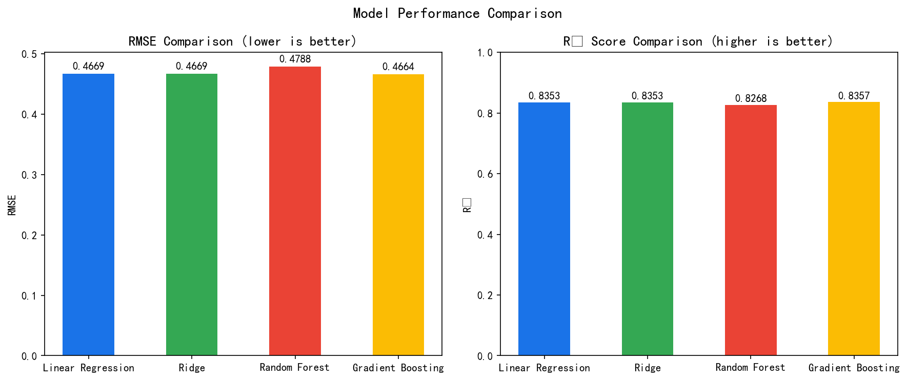
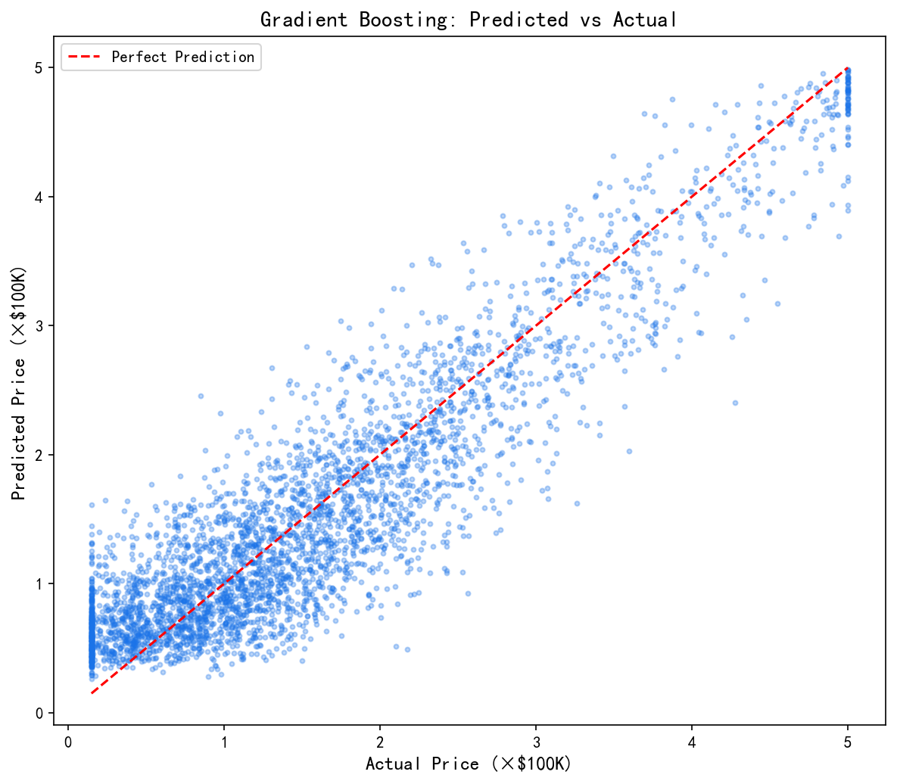
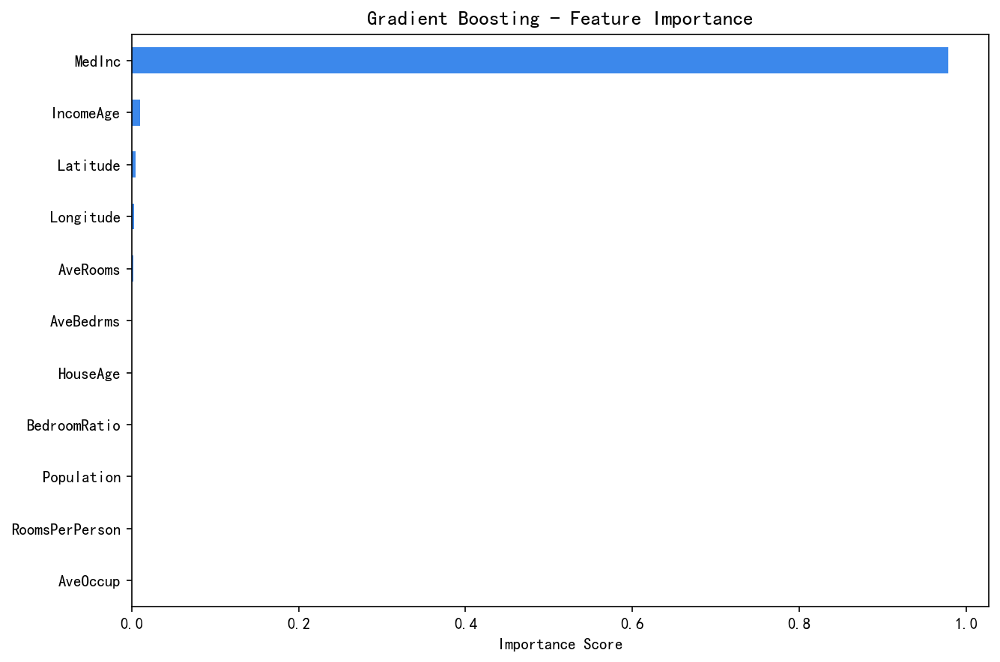

# 加州房价预测分析

一个完整的数据分析项目，基于加州房价数据集（20,640 条样本），涵盖数据探索、清洗、建模与可视化的完整流程。

## 项目简介

本项目使用 Python 完成端到端房价预测分析，涵盖以下环节：

- 探索性数据分析（EDA）
- 数据清洗与特征工程
- 多种回归模型对比
- 地理分布可视化
- 模型性能评估

## 项目结构

```
house-price-analysis/
├── data/
│   ├── raw/                        # 原始数据（首次运行自动生成）
│   │   └── california_housing.csv
│   └── processed/                  # 清洗后数据
│       └── cleaned_data.csv
├── notebooks/
│   └── analysis.ipynb              # 交互式分析 Notebook
├── src/
│   ├── __init__.py
│   ├── data_loader.py              # 数据加载模块
│   ├── preprocessing.py            # 清洗与特征工程
│   └── visualization.py            # 图表生成
├── outputs/
│   ├── figures/                    # 生成的图表（共 7 张）
│   └── reports/
│       └── model_performance.txt   # 模型对比报告
├── main.py                         # 程序入口
├── requirements.txt
├── .gitignore
└── README.md
```

## 数据集字段说明

| 字段 | 含义 |
|------|------|
| MedInc | 区块收入中位数（万美元） |
| HouseAge | 房屋房龄中位数（年） |
| AveRooms | 平均房间数 |
| AveBedrms | 平均卧室数 |
| Population | 区块总人口 |
| AveOccup | 平均入住人数 |
| Latitude | 纬度 |
| Longitude | 经度 |

**目标变量**：`MedHouseVal` — 房价中位数（×10万美元）

---

## 分析结果展示

### 1. 目标变量分布

房价分布呈右偏态，经 log 变换后更接近正态分布，适合回归建模。



### 2. 特征相关性热力图

收入（MedInc）与房价相关性最强（> 0.7），房龄次之。部分特征之间存在多重共线性，需在建模时注意。



### 3. 关键特征与房价关系

收入越高、房间数越多的区域，房价显著更高；地理上呈现明显的沿海高价聚集现象。



### 4. 地理分布热力图

加州房价呈现明显的地理聚集效应——沿海区域（洛杉矶、旧金山湾区）价格显著高于内陆地区。



### 5. 模型性能对比

对比了 4 种回归模型，梯度提升（Gradient Boosting）在 R² 和 RMSE 上均表现最优。



### 6. 最优模型：预测 vs 实际

梯度提升模型的预测值与真实值高度吻合，对角线附近的点越密集说明预测越准确。



### 7. 特征重要性

收入（MedInc）是最重要的特征，其次是地理位置（经纬度）和房间数。特征工程新增的衍生特征也进入了重要性前列。



---

## 模型结果汇总

| 模型 | RMSE | R² |
|------|-------|-----|
| Linear Regression | 0.4669 | 0.8353 |
| Ridge | 0.4669 | 0.8353 |
| Random Forest | 0.4788 | 0.8268 |
| **Gradient Boosting** | **0.4664** | **0.8357** |

> 最优模型：**Gradient Boosting**，R² = 0.8357

---

## 快速开始

```bash
# 1. 克隆仓库
git clone https://github.com/limbo-7/house-price-analysis.git
cd house-price-analysis

# 2. 创建虚拟环境
python -m venv venv
venv\Scripts\activate       # Windows
# source venv/bin/activate  # Linux/macOS

# 3. 安装依赖
pip install -r requirements.txt

# 4. 运行完整分析流程
python main.py
```

运行完成后，所有图表将保存至 `outputs/figures/`，性能报告保存至 `outputs/reports/`。

## 技术栈

- **Python 3.8+**
- **pandas / numpy** — 数据处理
- **scikit-learn** — 预处理、建模、评估
- **matplotlib / seaborn** — 数据可视化

## 核心结论

1. **收入（MedInc）** 是房价最强的预测因子，相关性超过 0.7。
2. **地理位置** 对房价影响显著，沿海区域存在明显溢价。
3. **梯度提升树** 能够捕捉非线性关系，R² 达到 0.8357，优于线性模型。
4. **特征工程**（人均房间数、卧室占比、收入×房龄交互）对提升模型性能有贡献。

## 许可证

MIT License
